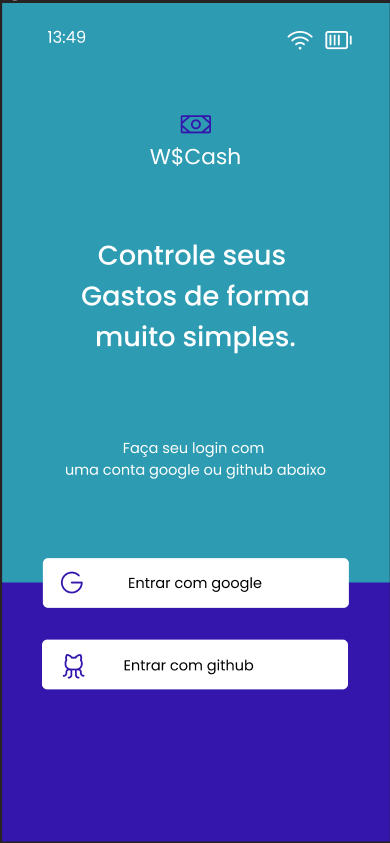

# Aplicativo Cashbackws

Aplicativo onde usuário pode estar fazendo o gerenciamento financeiro de seus gasto seja eles diários, mesais ,semestrais e até mesmo anuais.

### Ambiente de configuração

Projeto criado com React Native CLI.[ See official docs](https://reactnative.dev/docs/environment-setup) para configurar o ambiente.

### Run

**Install dependencies**

```
yarn or npm install
```

**Install IOS Pods**

```
cd ios && pod install
```

**Run IOS**

```
yarn ios
```

**Run Android**

```
yarn android or npx react-native run-android
```

### 🛠 Tecnologia e bibliotecas

-   [React Native](https://reactnative.dev/)
-   [TypeScript](https://www.typescriptlang.org/): Tipagem de dados
-   [Styled-Components](https://styled-components.com/): Estilização de components
-   [React Navigation](https://reactnavigation.org/): Roteamento e navegação
-   [Async Storage](https://react-native-async-storage.github.io/async-storage/): Sistema de armazenamento de dados
-   [Axios](https://github.com/axios/axios): Cliente HTTP baseado em promessa
-   [React Query](https://react-query.tanstack.com/): Busca, cache, sincronização e atualização do estado do servidor
-   [Jest](https://jestjs.io/pt-BR/): Framework de Testes em JavaScript com um foco na simplicidade.
-   [React-Native-Testing-Library](https://callstack.github.io/react-native-testing-library/docs/getting-started/): Para escrever teste automatizados
-   [React-Native-Responsive-FontSize](https://github.com/heyman333/react-native-responsive-fontSize): Tamanho de tela responsivo

### Capturas de tela do aplicativo

|             |                 Android                  |                 IOS                  |
| :---------: | :--------------------------------------: | :----------------------------------: |
| Sign Screen |  |  |
| Home Screen |  |  |
